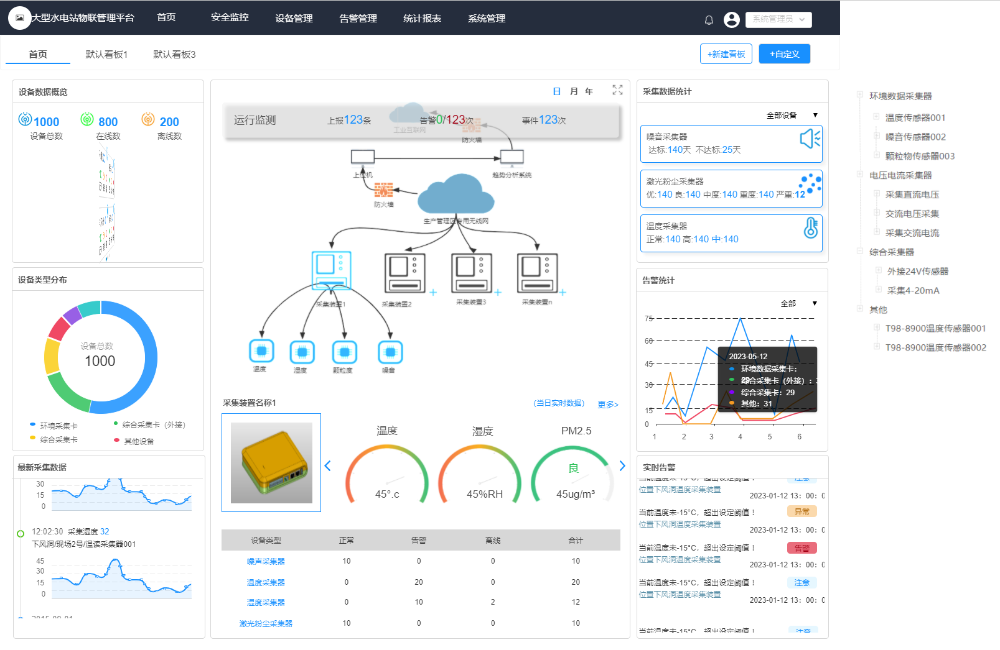

**乌东德水电站**
> 乌东德水电站（采集终端）初版示例程序，包含：          
>  shm数据采集、websocket数据上报、json解析、json构建、 
> 

## Usage
* ./make_build.sh  #编译
* 同步运行： 
* ./proc_test -g  #生成json配置， 用户补充其余字段）
* ./proc_test #主程序）
* ./wdd_shm_test VOL  #共享内存测试程序-电压测试）
* ./ws_server_test #模拟上位机服务端）
* 

## 稳定性测试
1. 测试环境： 
    * 平台：192.168.101.200
    * 文件：/xlian/wdd_pack
    * 服务器： 
2. 测试配置：
    * 环境变量： export LD_LIBRARY_PATH="/xlian/lib:$LD_LIBRARY_PATH"
3. 测试主程序：
    * ./proc_test > log_date.log
4. 模拟服务端：
    * ./ws_server_test > serv_log.log
    * while [ 1 ]; do tail -n 50 serv_log.log; sleep 1; done;
5. 模拟共享内存：
    * ./wdd_shm_test VOL        # 电压测试

##乌东德及其代码问题整理：    
1.websocket发送json与上位机通信；   
2.数据上送应采用周期全量上送；  
3.如何通过时间判断数据是否采集成功？    
4.采集失败告警上送；    
5.配置文件：    
        隐藏无需用户配置的配置项；  
        需要配置单位的增加单位配置；    
        无单位配置时采用默认单位；  
        配置字段命名规范；  
        配置规则通过独立的文档来说明；  
6.代码规范：    
        函数、变量命名风格统一，通过名称知其意；    
        增加关键注释；  
        局部变量定义时应有初始化的习惯；    
        去掉多余的无用的代码；  
        考虑函数返回状态及其处理；  

