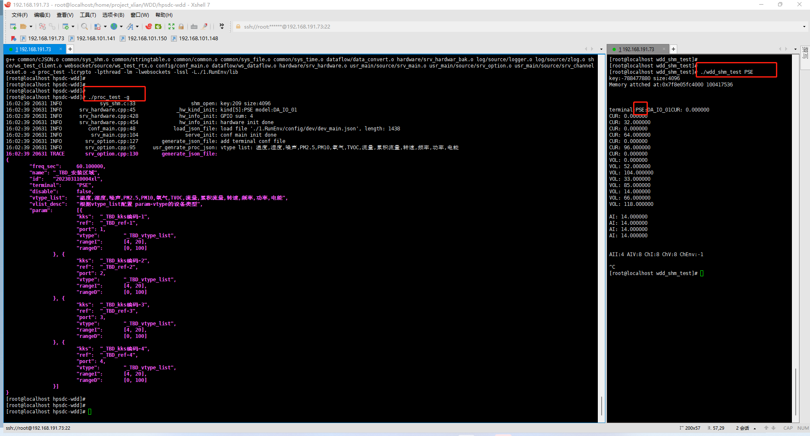
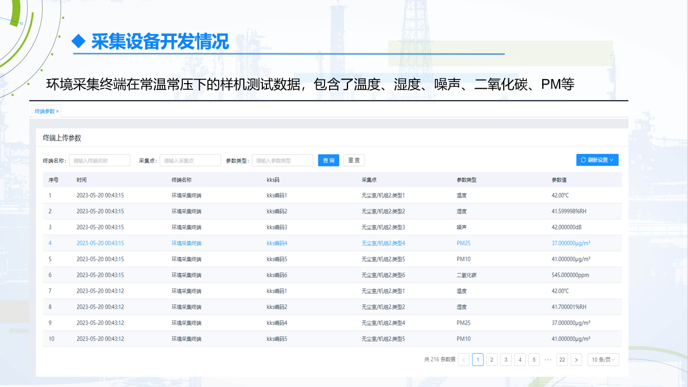

# 乌东德水电站
> 乌东德水电站（采集终端）初版示例程序，包含：          
>  shm数据采集、websocket数据上报、json解析、json构建等
> 

**界面演示：**

**运行示例：**

**采集数据展示：**

    

**采集数据展示：**

## Usage
* ./make_build.sh  #编译
* 同步运行： 
* ./proc_test -g  #生成json配置， 用户补充其余字段）
* ./proc_test #主程序）
* ./wdd_shm_test VOL  #共享内存测试程序-电压测试）
* ./ws_server_test #模拟上位机服务端）

## 稳定性测试
1. 测试环境： 
    * 平台：192.168.101.200
    * 文件：/xlian/wdd_pack
    * 服务器： 
2. 测试配置：
    * 环境变量： export LD_LIBRARY_PATH="/xlian/lib:$LD_LIBRARY_PATH"
3. 测试主程序：
    * ./proc_test > log_date.log
4. 模拟服务端：
    * ./ws_server_test > serv_log.log
    * while [ 1 ]; do tail -n 50 serv_log.log; sleep 1; done;
5. 模拟共享内存：
    * ./wdd_shm_test VOL        # 电压测试

